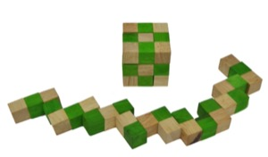
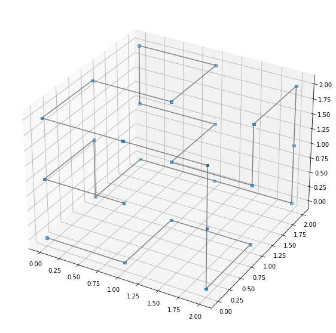

# box_sim

# Snake 2 Box
Lately i stumbled upon a 3D puzzle from a shop called [GAYA](https://gaya-game.co.il/collections/games-and-puzzles/products/product-18?variant=31635902915)

## The puzzle
The puzzle is devilishly simple – a 3x3x3 array of 27 wooden blocks all tied tightly together with a hidden elastic string.\
Each small block is either a "straight-through" piece (elastic emerges on opposite faces) or a "corner" piece (elastic emerges on two adjacent faces).\
The goal is to twist the blocks so that the 27 blocks form a cube… again.

After trying to solve this puzzle many times, testing diffrent approaches I couldn't find any other way than simulate this issue with Python.

## The results

# Using box_sim
If you want to understand more go to Snake2Box.ipynb
<pre><code>   
pip install poetry # if you didn't installed yet
git clone \<repo url\>
cd \<repo name\>
poetry install

poetry puzzle.py --help
usage: puzzle.py [-h] --algo a [--depth d] [--viz_snake] [--viz_tree]

optional arguments:
  -h, --help   show this help message and exit\
  --algo a     The algorithem to solve with current option [dfs, bfs]\
  --depth d    The max depth to traverse. default is 27 in which the puzzle is solved.\
  --viz_snake  Visualize the snake when done.\
  --viz_tree   Visualize the traversed tree when done.\
  </pre></code>

