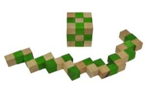

# Snake 2 Box — 3D Web App

A 3D interactive puzzle solver for the Snake 2 Box puzzle. Built with React + Three.js (frontend) and FastAPI (backend).

## The Puzzle

A 3×3×3 array of 27 wooden blocks linked by an elastic string. Each block is either "straight" (elastic goes through) or "corner" (elastic turns 90°). The goal: fold the snake chain into a perfect cube.



## Web App

- 3D visualization with Three.js + React Three Fiber
- Step-by-step animation of the folding solution
- Play/pause, scrubber, speed control
- Dark theme, blocks colored by type

## Running Locally

```bash
# Install dependencies
pip install fastapi uvicorn numpy scipy matplotlib pandas networkx
cd frontend && npm install

# Start backend (port 8000)
python3 -m uvicorn backend.main:app --reload --port 8000

# Start frontend (port 5173)
cd frontend && npm run dev
```

Then open http://localhost:5173

## Stack

- **Frontend**: React + Vite + Three.js (@react-three/fiber, @react-three/drei)
- **Backend**: FastAPI + Python (original solver logic preserved)
- **Algorithm**: DFS search through 4^27 rotation space, pruning invalid states

## Solution

The solved option string: `000120020010310231120202033`

Each character (0-3) represents the rotation applied at each corner block.
