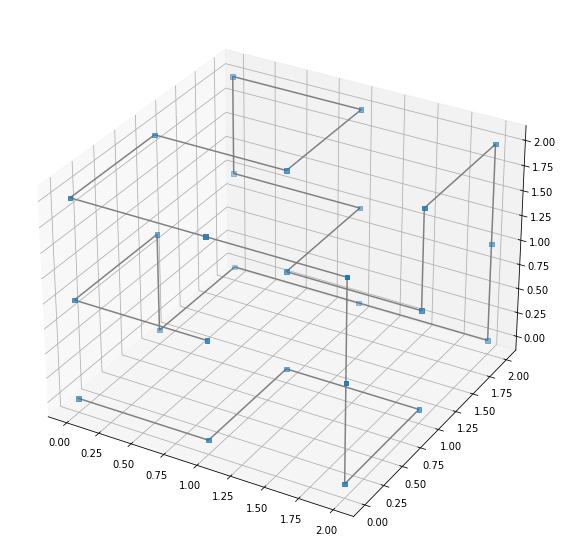

# Snake 2 Box

## 🌐 Web App

**Live demo: https://snake2box.onrender.com**

An interactive 3D web app that visualizes and animates the solution to the Snake 2 Box puzzle.

- 3D block visualization with Three.js
- Step-by-step animated folding of the snake into a cube
- Play/pause, scrubber, and speed controls
- Color-coded blocks: corner (purple) vs straight (blue)
- Mobile friendly

To run locally:
```bash
# Backend (port 8000)
uv sync
uv run uvicorn backend.main:app --reload --port 8000

# Frontend (port 5173, new terminal)
cd frontend && npm install && npm run dev
```

---

## The Puzzle — Snake 2 Box

A 3×3×3 array of 27 wooden blocks all tied together with a hidden elastic string.
Each block is either a "straight-through" piece (elastic emerges on opposite faces) or a "corner" piece (elastic emerges on two adjacent faces).
The goal is to twist the blocks so that all 27 form a cube.

Puzzle from [GAYA](https://gaya-game.co.il/collections/games-and-puzzles/products/product-18?variant=31635902915)


After trying to solve this puzzle many times with different approaches, I ended up simulating it in Python.

## Results




## CLI Usage

```bash
uv sync

uv run puzzle.py --help
usage: puzzle.py [-h] --algo a [--depth d] [--viz_snake] [--viz_tree]

optional arguments:
  -h, --help   show this help message
  --algo a     Algorithm to solve with [dfs, bfs]
  --depth d    Max depth to traverse (default 27)
  --viz_snake  Visualize the snake when done
  --viz_tree   Visualize the traversed tree when done
```


## Solution

The solved option string: `000120020010310231120202033`

Each character (0–3) represents the rotation applied at each corner block.
